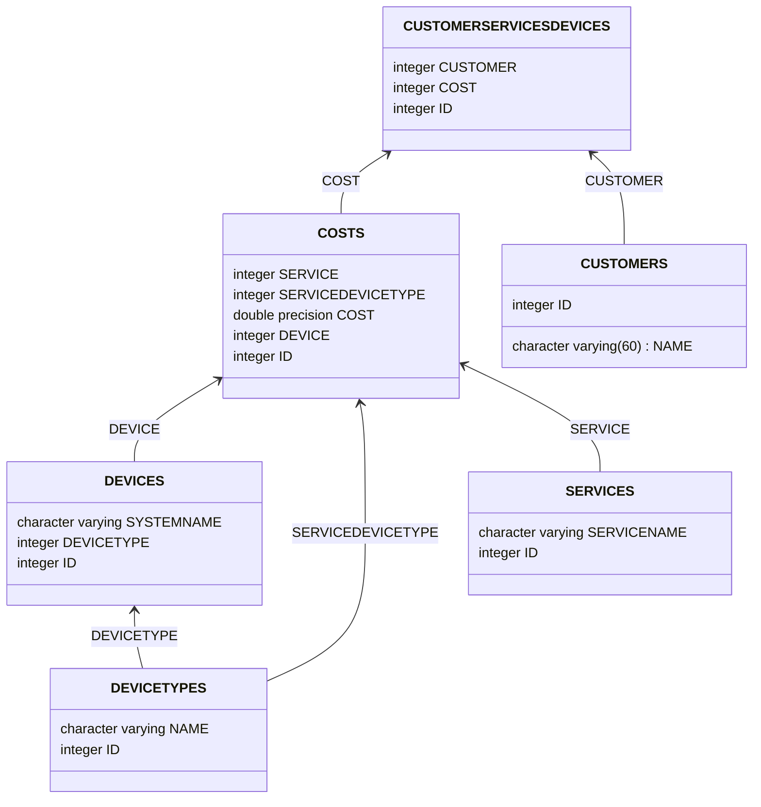

# BACKEND ENGINEER TASK FOR NINJAONE

* By Felipe Diaz C: [felipediazc@gmail.com](mailto:felipediazc@gmail.com)

Disclaimer: Please use a Markdown editor/viewer with mermaid support in order to have access to the ERD diagram

### SOFTWARE REQUIREMENTS

You need MAVEN 3.8.1 and JAVA 13 installed in your PC, MAC or LINUX.

### HOW TO PACKAGE

mvn clean install

### HOW TO TEST

If you want to do the unit and integration test, please use the following instruction:

mvn test

### HOW TO PACKAGE WITHOUT TESTING

mvn clean install -DskipTests

### HOW TO DOWNLOAD ALL DEPENDENCIES

mvn install dependency:copy-dependencies

## HOW TO RUN (Default port is 8080)

There is two alternatives to run de application

1. mvn spring-boot:run
2. java -jar target/rmm-0.0.1-SNAPSHOT.jar

## ENDPOINTS

http://localhost:8080/swagger-ui/index.html?configUrl=/v3/api-docs/swagger-config#/

## CODE COVERAGE

Please look into the target/site/jacoco folder for de index.html file

# ABOUT THE TECHNICAL TEST

A Remote Monitoring and Management (RMM) platform helps IT professionals manage a fleet of Devices with Services
associated with them. This Web Service will fulfill the most basic requirements of an RMM by keeping a simple inventory
of Devices and Services to calculate their total costs.

Breakdown of Service costs:

* Each Device costs $4
* Antivirus costs $5 for each Windows, $7 for each Mac per Device
* Backup costs $3 per Device
* PSA costs $2 per Device
* Screen Share costs $1 per device

Devices have the following properties:

* Id
* System Name
* Type (Windows Workstation, Windows Server, Mac, etc.)

## Feature Requirements

Implement endpoints and logic for the following.

* Get, Add, Update or Delete Devices. Duplicate Devices should not be allowed. b. Add, Delete available Services.
  Duplicate Services should not be allowed.
* Calculate the total monthly cost of the services depending on Services used
  by a Device.

Example:

Customer with 2 Windows, 3 Mac with Antivirus, Backup, and Screen Share.
Total Cost: $71

Explanation: Devices cost: $20 Antivirus cost: $31 Backup: $15 Screen Share: $5

## Solution

A H2 database was implemented with the following structure

In order to accomplish the requirements, an initial data was injected into it with the same data regarding services and
devices cost. Also, there is a default customer (customerid: 1) to run the total monthly cost, which in this case,
produces the same response as the example above

### How to manipulate data

Endpoints for each table was implemented, please refer to the swagger-ui
URL http://localhost:8080/swagger-ui/index.html?configUrl=/v3/api-docs/swagger-config#/ to use them. All of them are
well documented (their goals, payloads and responses).
If you want to add data from scratch (from devicetype to devices/services per customer) please do the following steps:

1. Add customers. By default, there is a customer called FELIPE DIAZ with customerId = 1. At this time, there is no
   endpoints to manipulate customers
2. Add a device type. By default, there is the following device types in the DEVICETYPES table : [LINUX, MAC, WINDOWS].
   If you want to add more, please use the endpoint /devicetype (POST) located under the device-types-controller
   section. Keep in mind that the device type name is UNIQUE and is restricted by the database
3. Add a device. Please use the endpoint /device (POST) located under the devices-controller section. Keep in mind that
   the device name is UNIQUE and is restricted by the database
4. Add a service. Please use the endpoint /service (POST) located under the services-controller section. Keep in mind
   that the service name is UNIQUE and is restricted by the database
5. Add a cost. Please use the endpoint /cost (POST) located under the costs-controller section. Keep in mind that if you
   want to add a service, you need to fill the service and servicedevicetype fields and keep device field empty. If you
   want to add a device, you must keep service and servicedevicetype fields empty.
6. Finally, you need to attach services/devices to a customer and in order to do that, you must use the endpoint
   /customerservicesdevices (POST) located under customer-services-devices-controller section

### How to calculate the total monthly cost

Please use the endpoint /monthlycost/{customerid} (GET) located under the customer-services-devices-controller section

### How to get, add update or delete devices

Please use the following endpoints respectively (all of them located under the devices-controller)

* /device (GET) <--- list all devices
* /device/{id} (GET) <--- show a device according its id
* /device (POST) <-- add a device
* /device (PUT) <-- update a device

### How to add, delete services

Please use the following endpoints respectively (all of them located under the services-controller)

* /service (POST) <-- add a service
* /service/{id} (DELETE) <--- delete a service according its id
* /service (GET) <--- list all services
* /service/{id} (GET) <--- show a service according its id
